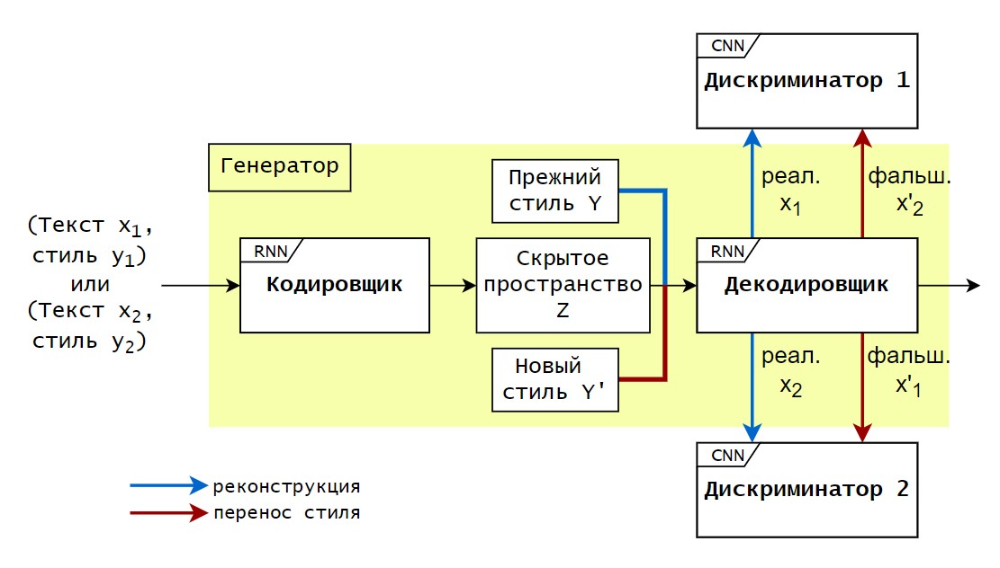

# NLP-style-transfer
4nd course, the graduation paper

### About
Solving style transfer ploblem with GAN. 

> Generator - Autoencoder Seq2Seq with style embedding

> Discriminators - 1-layer CNN with some filters

This work relies on researches 
1. [Style Transfer from Non-Parallel Text by Cross-Alignment](https://arxiv.org/abs/1705.09655)
2. [Generate Modern Chinese Poems from News Based on Text Style Transfer Using GAN](https://ieeexplore.ieee.org/document/8959907)

### GAN architecture

## How to run
`download_data.ipynb` for download poems from site

`data_preproc.ipynb` to preprocess news from dataset and downloaded poems and make new token model

`gru_seq2seq.ipynb` for training and validation generator withour style vectors

`Style_transfer_model.ipynb` for training and validation GAN

`Style_transfer_model_len.ipynb` for training and validation GAN with the progressive length upbuiding

`CNN_discr_STresult_Test.ipynb` to try using final model or count metrics for results

## Data
 I have worked with russian language only and used 2 styles - poems and news.
 
### datasets
- [Dataset](https://github.com/RossiyaSegodnya/ria_news_dataset) with russian news (abt 1 mln)
- Poems from portal [Stihi.ru](https://stihi.ru/poems/)

### preprocessing
- sentence tokenizer NLTK
- re-expresssions
- tokenizer [YouTokenToMe](https://github.com/VKCOM/YouTokenToMe)
- pretrained word embeddings from [Navec](https://github.com/natasha/navec) (only for test metrics)

## Samples
### news to poem
*рождественские ели которые украшали дома большинства жителей вены будут сожжены на биоэлектростанции в зиммеринге 
километров от австрийской столицы и сослужат последнюю службу людям подарив им тепло .*
______________________________________

*рождественские ели мы украшали*

*дома и вены будут сожжены напополам*

*мы вдвоем*

*огонь от страсти столицы*

*сослужит лишь подарив им все тепло .*

### poem to news
*фотограф как то раз меня снимая*

*на фоне ослепительного дня*

*случайно проронил что роковая*

*на самом деле внешность у меня .*
______________________________________

*фотограф словом то раз недалеко снимаяльного на фоне дорожностроительного дня. в декабре столице решение что что роковая на на самом деле внешность у минздрав*
